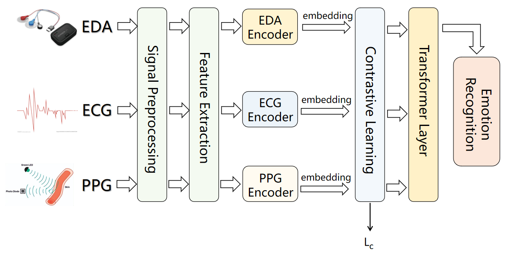

# Multimodal-Emotion-Recognition
## Overview

This repository is a course project from the **School of Biological Science and Medical Engineering, Beihang University (BUAA)**. It implements an end to end pipeline for multimodal emotion recognition, covering the full workflow from physiological signal acquisition and data processing to model training and evaluation.

The project uses three physiological modalities, **EDA** (electrodermal activity), **ECG** (electrocardiogram), and **PPG** (photoplethysmography), to perform four class emotion classification: **Sad**, **Calm**, **Happy**, and **Angry**. The codebase includes utilities to convert raw sensor logs into structured files, extract aligned 60 second windows, and train a multimodal model that jointly learns from the three signals.

## Data Collection

We collected data from **25 participants**. Each participant watched a **12 minute emotion elicitation video** that was **validated by psychology experts**. The video was designed to induce four target emotions, **Sad**, **Calm**, **Happy**, and **Angry**.

During the elicitation session, participants wore a wearable sensor device to record multiple physiological signals, including **ECG**, **EDA**, **PPG**, and motion related signals such as **acceleration**. These recordings form the raw multimodal data used in this project.

## Data Preprocessing

We first aligned the recorded physiological signals across modalities to ensure temporal consistency between **ECG**, **EDA**, **PPG**, and motion related channels. For each emotion segment within the full 12 minute elicitation session, we extracted a **60 second window** centered at the **midpoint** of that segment. These centered one minute windows are used as the model inputs.

After segmentation, we applied basic signal preprocessing steps to improve signal quality, including standard filtering operations such as **denoising filters** and **notch filtering** to reduce common interference.

In the `data` folder, we provide **sample examples** of the final processed data for reference. For access to the emotion elicitation video, the raw recordings, and the complete processed dataset, please contact **moyang_liu@buaa.edu.cn**.

## Model Training

The implementation of model training can be found in the `src` folder.

As illustrated above, the framework takes three physiological modalities, EDA, ECG, and PPG, as inputs. After signal preprocessing and feature extraction, each modality is encoded into a compact embedding. We further introduce a contrastive learning objective to encourage modality embeddings from the same sample to be close in the representation space while pushing apart embeddings from different samples. Finally, the modality embeddings are fused by a Transformer layer, and a classification head outputs the predicted emotion category among Sad, Calm, Happy, and Angry.

For the encoder, we use the Hugging Face PatchTST model as the backbone.

Hugging Face PatchTST reference:  
<https://huggingface.co/ibm-granite/granite-timeseries-patchtst>

## Demo

We plan to provide an end to end demo that covers data processing and emotion recognition inference.

Coming soon.

